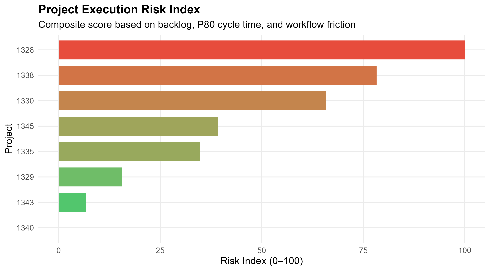
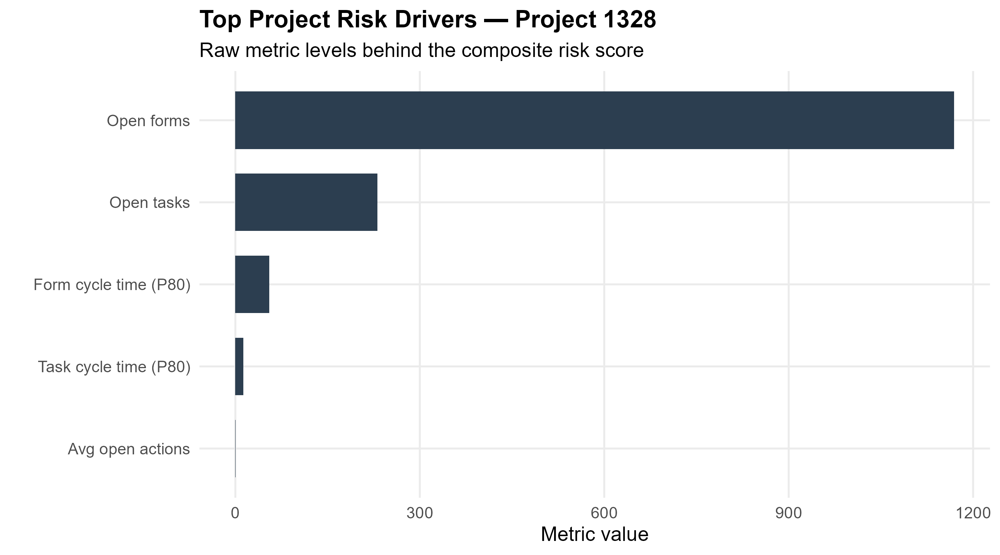
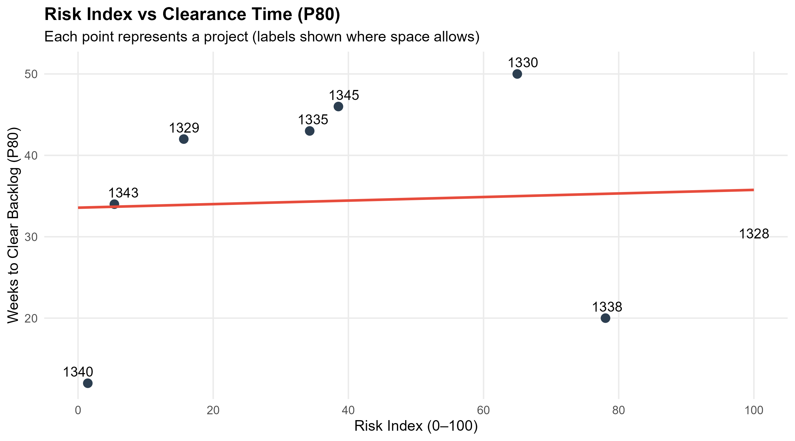
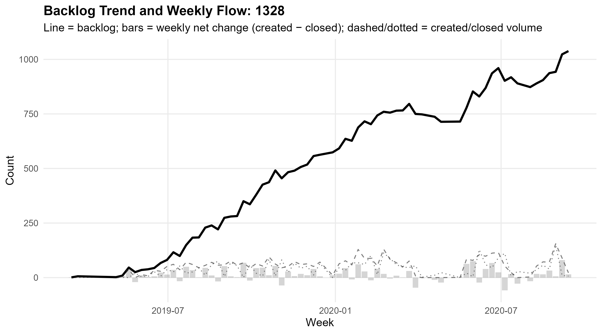
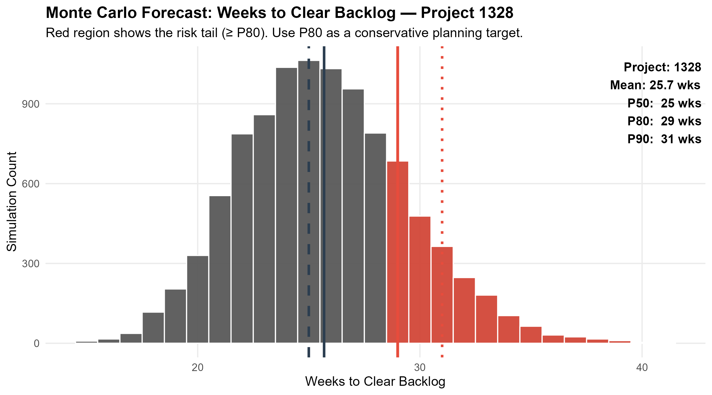

# Construction Project Risk Engine

## Overview
This project builds an execution risk engine for construction-style project management using workflow data (tasks + forms).  
The purpose of this project is to showcase and demonstrate large data wrangling and visualization applied to a dataset with real metrics and producible data. This is a personal project of mine that utilizes the R coding language and applies it to a dataset in relation with Construction Project Management. This project has risk and prediction models based on Monte Carlo simulation. The full capacity of this project produces a normalized Risk Index (0–100), identifies risk drivers, models backlog growth, and forecasts backlog clearance time using Monte Carlo simulation.

## Project Management Concepts Involved
KPI design and operational metrics such as cycle time
Risk ranking and driver analysis
Forecasting under uncertainty (Monte Carlo)
Data wrangling and Visualization
Data Analysis

## Data
In this project, two datasets were used to produce the analysis. These are simple datasets derived from a number of construction sites generated from project management field apps that are used for quality, safety a and site management. These datasets were made publicly available on Kaggle.
The two datasets are:
Construction_Data_PM_Forms_All_Projects
Construction_Data_PM_Tasks_All_Projects
Source Link:
https://www.kaggle.com/datasets/claytonmiller/construction-and-project-management-example-data

Cleaned outputs are saved under `data/clean/`.

### Risk Index (0–100)
The Risk Index is computed from standardized components:
- Open tasks
- Open forms
- P80 task cycle time
- P80 form cycle time
- Average open workflow actions

### Backlog & Throughput
Weekly backlog is computed as cumulative net flow:
- **Backlog(t) = Backlog(t-1) + (created - closed)**

### Monte Carlo Forecast
Backlog clearance time is simulated (10,000 runs) using historical weekly closure rate variability.
Key outputs: **P50 / P80 / P90** weeks-to-clear.

## Results (Data Visualizations)

### 1) Project Risk Ranking

**Interpretation**
- Higher scores indicate greater execution risk relative to other projects.
- The top-ranked project exhibits elevated backlog and slower tail-cycle times (P80).

### 2) Top Risk Drivers (Highest-risk Project)

**Interpretation**
- Highlights which components most contribute to the highest risk score.
- Useful for directing mitigation (throughput vs cycle-time reduction vs process friction).

### 3) Risk Index vs Clearance Time (Predictive Overlay)

**Interpretation**
- Shows whether the risk index predicts probabilistic delivery pressure (P80 clearance weeks).

### 4) Weekly Backlog Trend (Highest-risk Project)

**Interpretation**
- Net change (created − closed) explains backlog growth or burn-down.
- Persistent positive net change signals compounding schedule risk.

### 5) Monte Carlo Forecast: Weeks to Clear Backlog

**Interpretation**
- P50 = median forecast
- P80 = conservative planning target (recommended)
- P90 = tail-risk scenario
